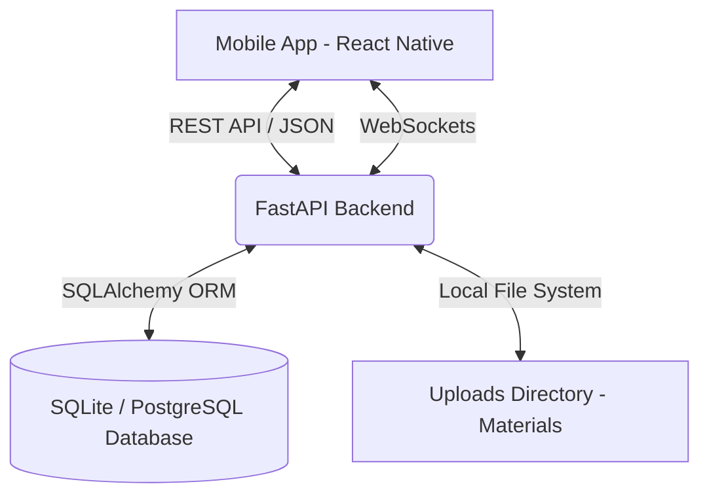

# Comprehensive Project Documentation: Learning Management System (LMS)

This document provides an in-depth look at the architecture, technology stack, and core workflows of the LMS Training Application. It is designed to help developers, stakeholders, and contributors understand how the system operates under the hood.

---

## 1. System Architecture Overview

The system follows a classic decoupled Client-Server architecture:

*   **Client (Frontend)**: A mobile application built with React Native and Expo. It handles all user interfaces, device hardware interactions (camera for facial recognition, local storage for offline files), and state management.
*   **Server (Backend)**: A RESTful API built with FastAPI (Python) that handles business logic, database interactions, facial embedding comparisons, and real-time WebSocket broadcasting.
*   **Database**: Uses SQLAlchemy as an ORM. Currently configured to use SQLite for rapid local development, with full compatibility to deploy to PostgreSQL (Supabase) for production.

### Data Flow Diagram

---

## 2. Detailed Technology Stack

### Frontend (Mobile Application)
*   **React Native & Expo**: Enables building cross-platform (iOS/Android) native apps using a single TypeScript codebase.
*   **Zustand**: A small, fast, and scalable bearbones state-management solution used for global stores (`authStore`, `courseStore`).
*   **React Navigation**: Provides routing and navigation, implementing strict role-based navigation stacks (Trainee Tabs, Trainer Tabs, Supervisor Tabs).
*   **Axios**: Promise-based HTTP client for the browser and node.js, configured with interceptors for automatic JWT token injection and refresh.
*   **Expo Modules**:
    *   `expo-camera`: For capturing images during the face registration and verification processes.
    *   `expo-file-system`: For downloading and saving course materials locally to allow offline viewing.
    *   `expo-video`: Native video playback for MP4 course materials.

### Backend (Server)
*   **FastAPI**: A modern, fast (high-performance) web framework for building APIs with Python 3.7+ based on standard Python type hints.
*   **SQLAlchemy**: The Python SQL toolkit and Object Relational Mapper that gives application developers the full power and flexibility of SQL.
*   **DeepFace & OpenCV**: Used for generating facial embeddings from uploaded images and comparing them for identity verification.
*   **PyJWT & Passlib**: Secure token generation, validation, and password hashing for user sessions.
*   **Uvicorn**: An ASGI web server implementation for Python, providing the asynchronous runtime for FastAPI.

---

## 3. Core Workflows

### A. Authentication & Face Registration Flow
The system uses a highly secure, multi-step authentication process designed to prevent identity fraud during training.

1.  **Identity Check**: User provides Employee ID and Mobile Number. Backend verifies they match HR records.
2.  **OTP Verification**: (Mocked) SMS OTP is sent and verified.
3.  **Face Registration (Trainees Only)**: If a trainee logs in for the first time, they are forced into the Face Onboarding screen. The app captures their face, the backend runs `DeepFace` to generate a vector embedding, and stores this embedding in the database.
4.  **JWT Issuance**: Upon successful login, the backend issues an `access_token` and `refresh_token`. The frontend stores these securely.

### B. Smart Attendance Flow
Attendance is time-restricted and biometric-secured.

1.  **Time Window Enforcement**: Attendance can *only* be marked exactly between the session's `start_time` and `end_time`. (Enforced on both Frontend UI and Backend API).
2.  **Facial Verification**:
    *   Trainee selects "Mark Attendance".
    *   App captures a live selfie.
    *   Backend extracts the embedding from the live selfie and computes the cosine distance against the stored embedding for that user.
    *   If the distance is below the acceptable threshold (e.g., 0.40 for Facenet), attendance is marked `PRESENT`.
3.  **Real-Time Sync**: The backend broadcasts an "attendance_marked" event via WebSockets, instantly updating the Trainer's dashboard to show the trainee has arrived.

### C. Course Material Delivery (Online & Offline)
1.  **Upload (Trainer)**: Trainers upload PDFs or MP4s. The backend saves them to a local `uploads/` directory and creates a database record.
2.  **Online Viewing**:
    *   **Videos**: Streamed directly into the Expo Video Player component.
    *   **PDFs**: Rendered seamlessly inside the app using the open-source Mozilla `pdf.js` web viewer, bypassing Google Docs limitations on private networks.
3.  **Offline Downloading**: Trainees can download materials. The app uses `expo-file-system` to save the file to the device's persistent storage and updates a local SQLite/AsyncStorage manifest. When offline, the app serves the file from the local URI instead of the network.

---

## 4. Database Schema Overview

The database is heavily normalized to ensure data integrity. Key relationships include:

*   **Users**: The central entity (`id`, `employee_id`, `role`, `face_embedding`).
*   **Courses**: Created by Trainers. A Course contains multiple `Modules`.
*   **Modules**: Logical groupings of `Materials` (PDFs, Videos) and `Quizzes`.
*   **TrainingSessions**: A scheduled occurrence of a Course at a specific time and venue.
*   **SessionEnrollments**: Mappings of Users (Trainees) to TrainingSessions.
*   **Attendance**: Tracks when a user verified their face and checked into a session.
*   **CourseEnrollments & Progress**: Tracks a user's progression through a course, culminating in `Certificates` when progress hits 100%.

---

## 5. Security & Constraints

*   **Role-Based UI Rendering**: `AppNavigator.tsx` strictly routes users based on their assigned role (`TRAINEE`, `TRAINER`, `SUPERVISOR`). A trainee physically cannot access the trainer dashboard components.
*   **Endpoint Protection**: FastAPI endpoints use `Depends(get_current_user)` to validate the JWT. Endpoints like "Upload Material" explicitly check `if current_user.role not in ["TRAINER", "SUPERVISOR"]:` and throw 403 Forbidden errors.
*   **Anti-Spoofing**: The system relies on hardware camera capture for face verification, making it extremely difficult to bypass attendance checks using static photos (future iterations will implement active liveness detection).
